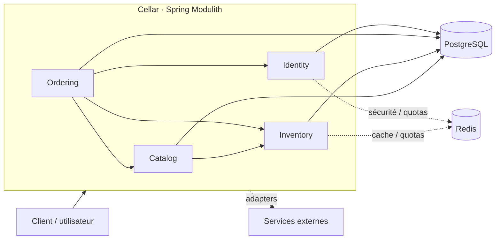
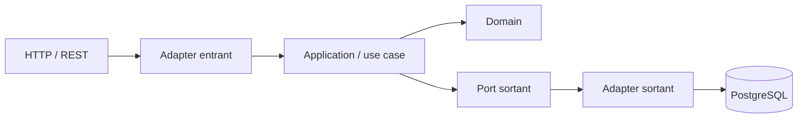

# Cellar

Cellar est une application de gestion de cave, de stock et de commandes destinée à Mjödheim.

Le projet est conçu comme un **monolithe modulaire** avec **Spring Modulith** : une seule application Spring Boot à déployer, mais des frontières métier explicites et vérifiables entre les modules.

## Problème métier

Cellar doit fournir une source de vérité unique pour répondre notamment à ces questions :

- quels produits existent ;
- quels lots sont réellement présents ;
- quelle quantité est disponible ou réservée ;
- pourquoi le stock a changé ;
- quels lots sont affectés à une commande ;
- quels lots doivent être consommés en priorité ;
- qui a effectué une opération ;
- peut-on reconstruire l'historique complet d'un mouvement.

## Modules métier

Le découpage initial est volontairement orienté **métier** :

- **catalog** — ce que Mjödheim propose : produits, types, informations commerciales ;
- **inventory** — ce qui existe physiquement : lots, stock, mouvements, allocations, FEFO ;
- **ordering** — ce qui est commandé : commandes, lignes, cycle de vie ;
- **identity** — qui utilise Cellar : utilisateurs, rôles, authentification et autorisations.

D'autres modules ne seront ajoutés que lorsqu'un besoin métier réel les justifiera.

## Vue d'ensemble



Les flèches représentent des dépendances ou collaborations autorisées au niveau conceptuel. Elles devront être matérialisées par des API de module explicites et vérifiées par Spring Modulith et les tests d'architecture.

## Clean Architecture à l'intérieur d'un module

Chaque module métier suit la même logique :

```text
module
├── API publique du module
└── internal
    ├── domain
    ├── application
    └── adapter
        ├── in
        │   └── web
        └── out
            └── persistence
```

Flux type :



Le **Domain** ne connaît ni HTTP, ni JPA, ni PostgreSQL, ni Redis. Les dépendances techniques restent aux bords.

## Pourquoi un Modulith ?

Cellar a besoin de frontières métier fortes, mais ne justifie pas plusieurs applications distribuées.

Le monolithe modulaire permet de garder :

- un seul déploiement ;
- une seule configuration ;
- des transactions simples et fiables ;
- un développement local facile ;
- des modules métier isolés ;
- des dépendances vérifiables ;
- une extraction future d'un module si elle devient réellement nécessaire.

On évite ainsi les coûts d'un système distribué sans revenir à un monolithe où tout peut appeler tout.

## Structure cible

```text
src/main/java/be/mjodheim/cellar/
├── CellarApplication.java
├── catalog/
│   └── internal/
│       ├── domain/
│       ├── application/
│       └── adapter/
│           ├── in/web/
│           └── out/persistence/
├── inventory/
│   └── internal/
│       ├── domain/
│       ├── application/
│       └── adapter/
│           ├── in/web/
│           └── out/persistence/
├── ordering/
│   └── internal/
│       ├── domain/
│       ├── application/
│       └── adapter/
│           ├── in/web/
│           └── out/persistence/
└── identity/
    └── internal/
        ├── domain/
        ├── application/
        └── adapter/
            ├── in/web/
            └── out/persistence/
```

> Les dossiers sont présents dès maintenant comme squelette architectural. Aucun code métier n'y est encore ajouté.

## Documentation

- [Architecture détaillée](docs/ARCHITECTURE.md)
- [Responsabilités des modules métier](docs/DOMAINS.md)

## Principe directeur

Avant d'ajouter une classe ou une dépendance, on doit pouvoir répondre à deux questions :

1. **À quel besoin métier répond-elle ?**
2. **À quel module appartient-elle ?**

Le code doit suivre le métier, pas l'inverse.


## Documentation métier détaillée

- [Product](docs/catalog/PRODUCT.md)
- [Batch](docs/inventory/BATCH.md)
- [StockMovement](docs/inventory/STOCK_MOVEMENT.md)
- [Allocation](docs/inventory/ALLOCATION.md)
- [Order](docs/ordering/ORDER.md)
- [OrderLine](docs/ordering/ORDER_LINE.md)
- [Pratiques professionnelles retenues](docs/PROFESSIONAL_PRACTICES.md)


## Sécurité et identité

Cellar utilise Spring Security en mode stateless avec :

- access tokens JWT courts ;
- refresh tokens opaques avec rotation ;
- BCrypt pour les mots de passe ;
- rôles `USER` et `ADMIN` ;
- soft delete des comptes ;
- Swagger configuré avec Bearer authentication.

Avant de démarrer l'application après activation de la sécurité, renseigner au minimum dans le `.env` :

```env
JWT_SECRET=<clé Base64 de 32 octets minimum>
```

Une clé locale peut être générée avec :

```bash
openssl rand -base64 32
```

Pour créer automatiquement le premier administrateur au démarrage, renseigner aussi :

```env
BOOTSTRAP_ADMIN_EMAIL=
BOOTSTRAP_ADMIN_NAME=
BOOTSTRAP_ADMIN_PASSWORD=
```

Les valeurs réelles ne doivent jamais être commitées.

Documentation détaillée :

- [Sécurité](docs/SECURITY.md)
- [User](docs/identity/USER.md)
- [RefreshToken](docs/identity/REFRESH_TOKEN.md)
