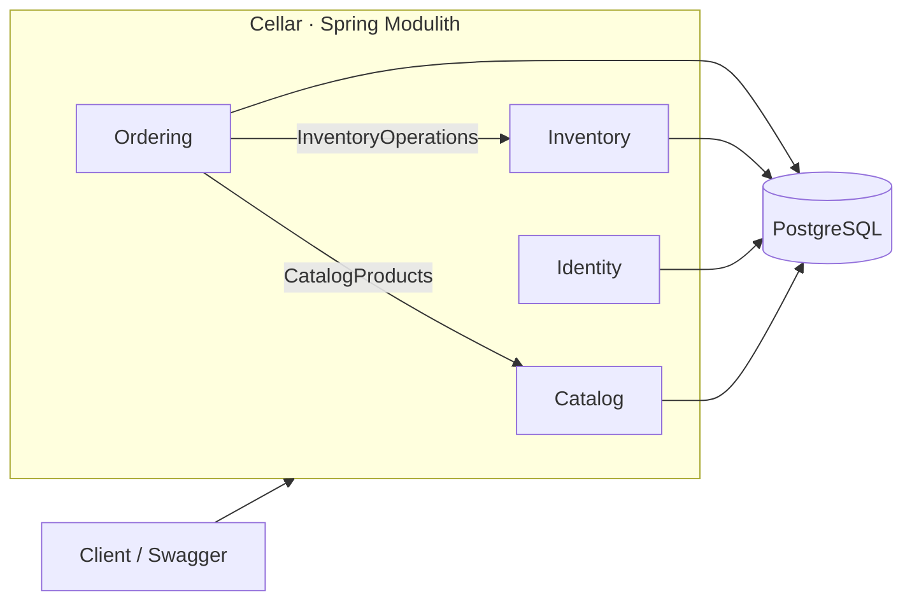
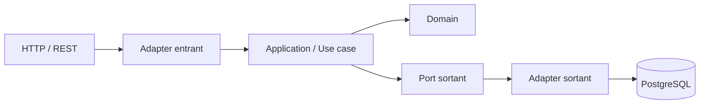

# Cellar

> Backend de gestion de cave, de stock et de commandes pour **Mjödheim**, construit comme un monolithe modulaire avec Spring Boot et Spring Modulith.

Cellar centralise le catalogue, les lots physiques, les mouvements de stock, les réservations FEFO, les commandes et les identités dans une seule application, tout en conservant des frontières métier explicites et testables.

---

## ✨ Ce que fait Cellar

Cellar sert de **source de vérité métier** pour répondre à des questions très concrètes :

- quels produits sont proposés ;
- quels lots sont réellement en cave ;
- combien d'unités sont en stock, disponibles ou réservées ;
- pourquoi le stock a changé ;
- quels lots ont été affectés à une commande ;
- quel lot doit être consommé en priorité selon FEFO ;
- quel était le nom et le prix d'un produit au moment d'une ancienne commande ;
- qui peut accéder à l'application et avec quels droits.

Le projet privilégie la **traçabilité**, les **règles métier explicites**, les **transactions cohérentes** et une architecture qui reste lisible lorsqu'il grandit.

---

## 🧭 Architecture

Cellar est un **monolithe modulaire** : une seule application à déployer, mais plusieurs modules métier isolés.



Les collaborations entre modules passent par des **API publiques explicites**. Les packages `internal` restent des détails d'implémentation propres à leur module.

Un test d'architecture Spring Modulith vérifie automatiquement les frontières et les cycles.

### Clean Architecture dans chaque module

```text
module
├── API publique du module
└── internal
    ├── domain
    ├── application
    │   └── port
    └── adapter
        ├── in
        │   └── web
        └── out
            ├── persistence
            └── security
```

Flux typique :



Le domaine ne connaît ni HTTP, ni JPA, ni PostgreSQL, ni Spring Security.

---

## 🧩 Modules métier

| Module | Responsabilité |
| --- | --- |
| **Catalog** | Produits proposés par Mjödheim, type, prix, état actif/inactif |
| **Inventory** | Lots physiques, stock disponible/réservé, mouvements, allocations, FEFO |
| **Ordering** | Commandes, lignes, snapshots commerciaux et cycle de vie |
| **Identity** | Utilisateurs, rôles, authentification, JWT, refresh tokens et soft delete |

### Catalog

`Product` représente **ce qui est vendu**, pas le stock physique.

### Inventory

`Batch` représente un **lot physique réel**.

```text
Product "Hydromel Classique"
├── LOT-2026-001
├── LOT-2026-002
└── LOT-2026-003
```

L'allocation suit **FEFO — First Expired, First Out** : les lots qui expirent le plus tôt sont consommés en priorité.

### Ordering

```text
DRAFT → CONFIRMED → PREPARING → SHIPPED
   └──────────────→ CANCELLED
```

Chaque `OrderLine` conserve un snapshot du **nom** et du **prix unitaire** du produit au moment de la commande.

### Identity

Le module Identity fournit l'inscription, la connexion, les rôles `USER` / `ADMIN`, BCrypt, les JWT courts, les refresh tokens opaques avec rotation et le soft delete des comptes.

---

## 🔐 Sécurité

Cellar fonctionne en mode **stateless** avec Spring Security.

| Ressource | Accès |
| --- | --- |
| Swagger / OpenAPI | Public |
| Health check | Public |
| Register / Login / Refresh / Logout | Public |
| Lecture Catalog | Authentifié |
| Écriture Catalog | ADMIN |
| Inventory | ADMIN |
| Orders | ADMIN |
| `/api/auth/me` | Authentifié |

Le JWT se transmet avec :

```http
Authorization: Bearer <access-token>
```

---

## 🗃️ Persistance et traçabilité

PostgreSQL est la source de vérité transactionnelle.

- **Flyway** gère les migrations versionnées ;
- Hibernate utilise `ddl-auto: validate` ;
- les contraintes critiques sont protégées au niveau SQL ;
- les opérations multi-entités importantes sont transactionnelles ;
- `StockMovement` sert de ledger immuable ;
- `Batch`, `Order` et `User` utilisent le soft delete ;
- `Product` utilise une désactivation métier.

Le schéma courant est à la migration **V7**, qui impose l'unicité des noms de produits sans distinction de casse.

Si des doublons existent déjà, V7 s'arrête sans supprimer de données. Renommer les produits concernés, puis relancer l'application.

---

## 🧪 Tests

Le projet couvre actuellement :

- invariants du domaine ;
- services applicatifs ;
- mappers et adapters de persistence ;
- contrôleurs REST avec MockMvc ;
- authentification et refresh tokens ;
- frontières Spring Modulith ;
- sécurité avec de vrais JWT et PostgreSQL temporaire ;
- concurrence des réservations, confirmations, expéditions et refresh tokens.

Les tests d'intégration utilisent **Testcontainers** : Java 26 et Docker démarré sont nécessaires. Ils créent leur propre base temporaire et ne lisent pas le fichier `.env` local. Le workflow GitHub Actions exécute la même suite.

```bash
bash mvnw test
```

Sous Windows :

```powershell
.\mvnw.cmd test
```

---

## 🚀 Démarrage local

### Prérequis

- Java **26**
- Docker / Docker Compose
- PostgreSQL via le compose local
- Maven Wrapper fourni dans le dépôt

### 1. Créer le fichier `.env`

Partir de `.env.example` et renseigner les valeurs locales.

```env
POSTGRES_HOST=localhost
POSTGRES_PORT=5432
POSTGRES_DB=
POSTGRES_USER=
POSTGRES_PASSWORD=

JWT_SECRET=
JWT_ISSUER=cellar
JWT_ACCESS_TOKEN_TTL=PT15M
JWT_REFRESH_TOKEN_TTL=P7D
```

Le `JWT_SECRET` doit être une clé Base64 représentant au moins 256 bits.

```bash
openssl rand -base64 32
```

Pour créer automatiquement le premier administrateur :

```env
BOOTSTRAP_ADMIN_EMAIL=
BOOTSTRAP_ADMIN_NAME=
BOOTSTRAP_ADMIN_PASSWORD=
```

> Les vraies valeurs restent exclusivement dans `.env`, qui est ignoré par Git.

### 2. Démarrer PostgreSQL

```bash
docker compose -f compose.local.yaml up -d
```

### 3. Lancer Cellar

Linux / macOS :

```bash
bash mvnw spring-boot:run
```

Windows :

```powershell
.\mvnw.cmd spring-boot:run
```

### 4. Ouvrir Swagger

```text
http://localhost:8080/swagger-ui/index.html
```

Flux de test conseillé :

```text
Login ADMIN
    ↓
Authorize dans Swagger
    ↓
Créer un Product
    ↓
Réceptionner un Batch
    ↓
Créer une Order
    ↓
Confirm → réservation FEFO
    ↓
Prepare
    ↓
Ship → consommation du stock + StockMovement
```

---

## 📁 Structure principale

```text
src/main/java/be/mjodheim/cellar/
├── CellarApplication.java
├── OpenApiConfig.java
├── catalog/
│   ├── CatalogProducts.java
│   ├── CatalogProductView.java
│   └── internal/
├── inventory/
│   ├── InventoryOperations.java
│   └── internal/
├── ordering/
│   └── internal/
└── identity/
    └── internal/
```

---

## 📚 Documentation

| Sujet | Document |
| --- | --- |
| Architecture | [ARCHITECTURE.md](docs/ARCHITECTURE.md) |
| Modules métier | [DOMAINS.md](docs/DOMAINS.md) |
| Pratiques professionnelles | [PROFESSIONAL_PRACTICES.md](docs/PROFESSIONAL_PRACTICES.md) |
| Sécurité | [SECURITY.md](docs/SECURITY.md) |
| Product | [catalog/PRODUCT.md](docs/catalog/PRODUCT.md) |
| Batch | [inventory/BATCH.md](docs/inventory/BATCH.md) |
| StockMovement | [inventory/STOCK_MOVEMENT.md](docs/inventory/STOCK_MOVEMENT.md) |
| Allocation | [inventory/ALLOCATION.md](docs/inventory/ALLOCATION.md) |
| Order | [ordering/ORDER.md](docs/ordering/ORDER.md) |
| OrderLine | [ordering/ORDER_LINE.md](docs/ordering/ORDER_LINE.md) |
| User | [identity/USER.md](docs/identity/USER.md) |
| RefreshToken | [identity/REFRESH_TOKEN.md](docs/identity/REFRESH_TOKEN.md) |

Les principales classes, méthodes publiques et frontières de modules disposent également de **Javadoc** directement consultable depuis l'IDE.

---

## 🛠️ Stack technique

```text
Java 26
Spring Boot 4
Spring Modulith
Spring Security
Spring Data JPA / Hibernate
PostgreSQL
Flyway
Springdoc OpenAPI / Swagger UI
JUnit 5
Mockito
Maven
Docker
```

---

## 🧱 Principes du projet

Avant d'introduire une nouvelle classe, une dépendance ou un module :

1. **À quel besoin métier cela répond-il ?**
2. **À quel module cela appartient-il ?**

L'objectif est de conserver un backend **compréhensible, testable, traçable et évolutif**.

---

## 🛣️ Prochaines étapes

Le socle métier, la sécurité, la documentation et la Javadoc sont en place. Les prochains chantiers concernent surtout la robustesse de production :

- idempotence des opérations critiques ;
- audit utilisateur ;
- pagination et recherche ;
- Redis et rate limiting lorsque leur utilité est démontrée ;
- déploiement automatisé ;
- dockerisation complète de l'application ;
- observabilité et stratégie de sauvegarde.
