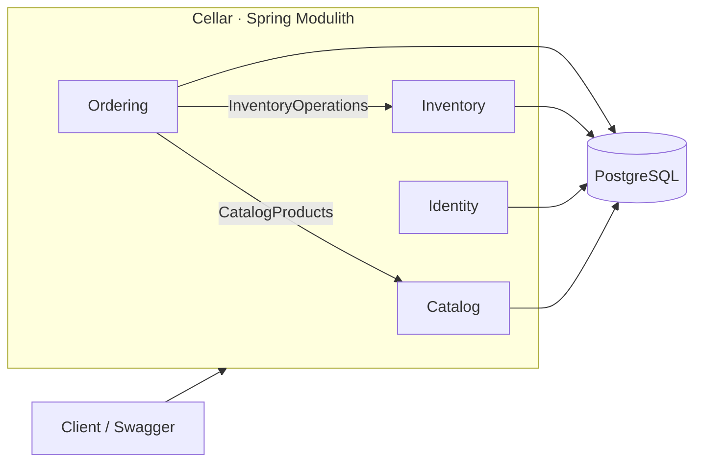
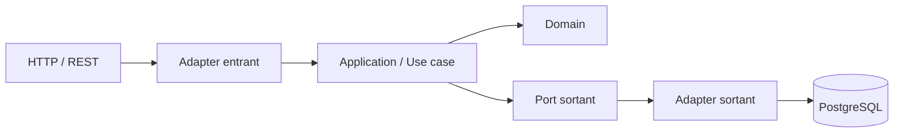

# Cellar

> Backend de gestion de cave, de stock et de commandes pour **Mjödheim**, construit comme un monolithe modulaire avec Spring Boot et Spring Modulith.

Cellar centralise le catalogue, les lots physiques, les mouvements de stock, les réservations FEFO, les commandes et les identités dans une seule application, tout en conservant des frontières métier explicites et testables.

---

## ✨ Ce que fait Cellar

Cellar sert de **source de vérité métier** pour répondre à des questions très concrètes :

- quels produits sont proposés ;
- quels lots sont réellement en cave ;
- combien d'unités sont en stock, disponibles ou réservées ;
- pourquoi le stock a changé ;
- quels lots ont été affectés à une commande ;
- quel lot doit être consommé en priorité selon FEFO ;
- quel était le nom et le prix d'un produit au moment d'une ancienne commande ;
- qui peut accéder à l'application et avec quels droits.

Le projet privilégie la **traçabilité**, les **règles métier explicites**, les **transactions cohérentes** et une architecture qui reste lisible lorsqu'il grandit.

---

## 🧭 Architecture

Cellar est un **monolithe modulaire** : une seule application à déployer, mais plusieurs modules métier isolés.



Les collaborations entre modules passent par des **API publiques explicites**. Les packages `internal` restent des détails d'implémentation propres à leur module.

Un test d'architecture Spring Modulith vérifie automatiquement les frontières et les cycles.

### Clean Architecture dans chaque module

```text
module
├── API publique du module
└── internal
    ├── domain
    ├── application
    │   └── port
    └── adapter
        ├── in
        │   └── web
        └── out
            ├── persistence
            └── security
```

Flux typique :



Le domaine ne connaît ni HTTP, ni JPA, ni PostgreSQL, ni Spring Security.

---

## 🧩 Modules métier

| Module | Responsabilité |
| --- | --- |
| **Catalog** | Produits proposés par Mjödheim, type, prix, état actif/inactif |
| **Inventory** | Lots physiques, stock disponible/réservé, mouvements, allocations, FEFO |
| **Ordering** | Commandes, lignes, snapshots commerciaux et cycle de vie |
| **Identity** | Utilisateurs, rôles, authentification, JWT, refresh tokens et soft delete |

### Catalog

`Product` représente **ce qui est vendu**, pas le stock physique.

Un produit conserve notamment son nom, son type, son volume, son prix et son état actif.

### Inventory

`Batch` représente un **lot physique réel**.

```text
Product "Hydromel Classique"
├── LOT-2026-001
├── LOT-2026-002
└── LOT-2026-003
```

Le module distingue :

- le stock physique ;
- le stock réservé ;
- le stock disponible ;
- les mouvements physiques immuables ;
- les allocations de stock aux lignes de commande.

L'allocation suit **FEFO — First Expired, First Out** : les lots qui expirent le plus tôt sont consommés en priorité.

### Ordering

Une commande suit actuellement le cycle :

```text
DRAFT → CONFIRMED → PREPARING → SHIPPED
   └──────────────→ CANCELLED
```

Chaque `OrderLine` conserve un snapshot du **nom** et du **prix unitaire** du produit au moment de la commande. Une modification future du catalogue ne réécrit donc jamais l'histoire commerciale.

### Identity

Le module Identity fournit :

- inscription et connexion ;
- rôles `USER` et `ADMIN` ;
- BCrypt pour les mots de passe ;
- access tokens JWT courts ;
- refresh tokens opaques avec rotation ;
- stockage uniquement du hash SHA-256 des refresh tokens ;
- soft delete des comptes ;
- bootstrap optionnel du premier administrateur.

---

## 🔐 Sécurité

Cellar fonctionne en mode **stateless** avec Spring Security.

Politique actuelle :

| Ressource | Accès |
| --- | --- |
| Swagger / OpenAPI | Public |
| Health check | Public |
| Register / Login / Refresh / Logout | Public |
| Lecture Catalog | Authentifié |
| Écriture Catalog | ADMIN |
| Inventory | ADMIN |
| Orders | Authentifié |
| `/api/auth/me` | Authentifié |

Le JWT se transmet avec :

```http
Authorization: Bearer <access-token>
```

Swagger expose également le bouton **Authorize** pour tester directement les endpoints protégés.

---

## 🗃️ Persistance et traçabilité

PostgreSQL est la source de vérité transactionnelle.

- **Flyway** est seul responsable des migrations ;
- Hibernate utilise `ddl-auto: validate` ;
- les contraintes critiques sont aussi protégées au niveau SQL ;
- les opérations multi-entités importantes sont transactionnelles ;
- `StockMovement` sert de ledger immuable pour expliquer les changements de stock ;
- `Batch`, `Order` et `User` utilisent le soft delete lorsque l'historique doit être conservé ;
- `Product` utilise une désactivation métier (`active=false`) plutôt qu'une suppression historique.

---

## 🧪 Tests

Le projet contient des tests sur plusieurs niveaux :

- invariants du domaine ;
- services applicatifs ;
- mappers et adapters de persistence ;
- contrôleurs REST avec MockMvc ;
- authentification et refresh tokens ;
- frontières Spring Modulith.

Lancer toute la suite :

```bash
./mvnw test
```

Sous Windows :

```powershell
.\mvnw.cmd test
```

---

## 🚀 Démarrage local

### Prérequis

- Java **26**
- Docker / Docker Compose
- PostgreSQL via le compose local
- Maven Wrapper fourni dans le dépôt

### 1. Créer le fichier `.env`

Partir de `.env.example` et renseigner les valeurs locales.

Au minimum :

```env
POSTGRES_HOST=localhost
POSTGRES_PORT=5432
POSTGRES_DB=
POSTGRES_USER=
POSTGRES_PASSWORD=

JWT_SECRET=
JWT_ISSUER=cellar
JWT_ACCESS_TOKEN_TTL=PT15M
JWT_REFRESH_TOKEN_TTL=P7D
```

Le `JWT_SECRET` doit être une clé Base64 représentant au moins 256 bits.

Exemple :

```bash
openssl rand -base64 32
```

Pour créer automatiquement le premier administrateur :

```env
BOOTSTRAP_ADMIN_EMAIL=
BOOTSTRAP_ADMIN_NAME=
BOOTSTRAP_ADMIN_PASSWORD=
```

> Les vraies valeurs restent exclusivement dans `.env`, qui est ignoré par Git.

### 2. Démarrer PostgreSQL

```bash
docker compose -f compose.local.yaml up -d
```

### 3. Lancer Cellar

Linux / macOS :

```bash
./mvnw spring-boot:run
```

Windows :

```powershell
.\mvnw.cmd spring-boot:run
```

Flyway applique automatiquement les migrations nécessaires au démarrage.

### 4. Ouvrir Swagger

```text
http://localhost:8080/swagger-ui.html
```

Flux de test conseillé :

```text
Login ADMIN
    ↓
Authorize dans Swagger
    ↓
Créer un Product
    ↓
Réceptionner un Batch
    ↓
Créer une Order
    ↓
Confirm → réservation FEFO
    ↓
Prepare
    ↓
Ship → consommation du stock + StockMovement
```

---

## 📁 Structure principale

```text
src/main/java/be/mjodheim/cellar/
├── CellarApplication.java
├── OpenApiConfig.java
├── catalog/
│   ├── CatalogProducts.java
│   ├── CatalogProductView.java
│   └── internal/
├── inventory/
│   ├── InventoryOperations.java
│   └── internal/
├── ordering/
│   └── internal/
└── identity/
    └── internal/
```

Chaque module contient sa logique métier, ses cas d'utilisation et ses adapters techniques sans exposer ses détails internes aux autres modules.

---

## 📚 Documentation

### Architecture

- [Architecture détaillée](docs/ARCHITECTURE.md)
- [Responsabilités des modules](docs/DOMAINS.md)
- [Pratiques professionnelles retenues](docs/PROFESSIONAL_PRACTICES.md)
- [Sécurité](docs/SECURITY.md)

### Catalog

- [Product](docs/catalog/PRODUCT.md)

### Inventory

- [Batch](docs/inventory/BATCH.md)
- [StockMovement](docs/inventory/STOCK_MOVEMENT.md)
- [Allocation](docs/inventory/ALLOCATION.md)

### Ordering

- [Order](docs/ordering/ORDER.md)
- [OrderLine](docs/ordering/ORDER_LINE.md)

### Identity

- [User](docs/identity/USER.md)
- [RefreshToken](docs/identity/REFRESH_TOKEN.md)

Les principales classes et frontières de modules disposent également de **Javadoc** afin qu'un développeur puisse comprendre l'intention du code directement depuis l'IDE.

---

## 🛠️ Stack technique

```text
Java 26
Spring Boot 4
Spring Modulith
Spring Security
Spring Data JPA / Hibernate
PostgreSQL
Flyway
Springdoc OpenAPI / Swagger UI
JUnit 5
Mockito
Maven
Docker
```

---

## 🧱 Principes du projet

Avant d'introduire une nouvelle classe, une dépendance ou un module, deux questions doivent rester simples à répondre :

1. **À quel besoin métier cela répond-il ?**
2. **À quel module cela appartient-il ?**

L'objectif n'est pas d'accumuler des frameworks, mais de conserver un backend **compréhensible, testable, traçable et évolutif**.

---

## 🛣️ Prochaines étapes

Le socle métier et la sécurité sont maintenant en place. Les prochains chantiers concernent surtout la robustesse de production :

- tests d'intégration PostgreSQL / Testcontainers ;
- concurrence et verrouillage du stock ;
- idempotence des opérations critiques ;
- audit utilisateur ;
- gestion globale et normalisée des erreurs ;
- pagination et recherche ;
- Redis et rate limiting lorsque leur utilité est démontrée ;
- CI/CD ;
- dockerisation complète de l'application ;
- observabilité et stratégie de sauvegarde.

