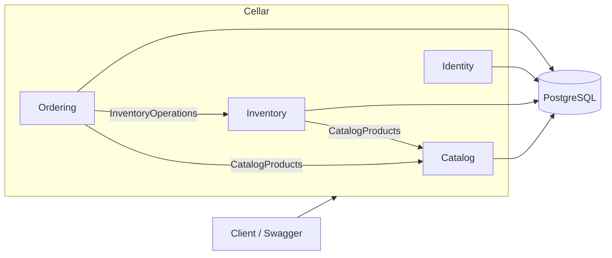
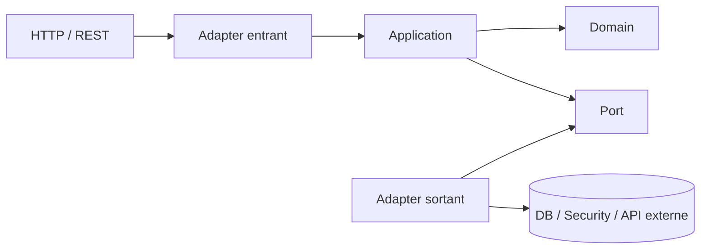

# 🧭 Architecture de Cellar

> **Décision structurante :** Cellar est un **monolithe modulaire Spring Boot + Spring Modulith**, organisé par capacité métier et structuré en Clean / Hexagonal Architecture à l'intérieur de chaque module.

---

## 🎯 Objectif

L'architecture cherche à obtenir quatre qualités :

| Objectif | Comment |
| --- | --- |
| **Lisibilité** | le premier niveau de découpage est métier |
| **Isolation** | chaque module protège ses détails internes |
| **Testabilité** | domaine et cas d'usage restent découplés des frameworks |
| **Évolutivité** | un module peut évoluer sans casser les autres |

Le but n'est pas d'ajouter des couches pour le principe, mais de rendre les responsabilités explicites.

---

## 🧩 Modules applicatifs

```text
catalog
inventory
ordering
identity
```

### Vue d'ensemble



---

## 🏗️ Structure interne d'un module

```text
module/
├── API publique du module
└── internal/
    ├── domain/
    ├── application/
    │   └── port/
    └── adapter/
        ├── in/
        │   └── web/
        └── out/
            ├── persistence/
            └── security/
```

### API publique

Le package racine contient uniquement ce que les autres modules sont autorisés à utiliser.

Exemples actuels :

```text
catalog.CatalogProducts
catalog.CatalogProductView
catalog.ProductNotFoundException
inventory.InventoryOperations
inventory.InsufficientStockException
```

### `internal/domain`

Contient le modèle métier pur :

- entités ;
- enums ;
- invariants ;
- transitions d'état ;
- calculs métier.

Le domaine ne dépend pas de Spring MVC, JPA, PostgreSQL ou Spring Security.

### `internal/application`

Contient :

- cas d'usage ;
- orchestration ;
- transactions ;
- ports entrants/sortants ;
- coordination entre agrégats.

### `internal/adapter/in`

Ce qui entre dans le module :

- contrôleurs REST ;
- request DTO ;
- response DTO ;
- validation HTTP.

### `internal/adapter/out`

Ce qui relie le module au monde technique :

- JPA / PostgreSQL ;
- sécurité ;
- demain : Redis, génération de documents, stockage de fichiers, API externes.

---

## ➡️ Sens des dépendances



> Le domaine ne connaît jamais ses adapters.

---

## 🔗 Collaboration entre modules

Un module ne doit jamais importer les classes `internal` d'un autre module.

### ❌ À éviter

```text
ordering
  └── catalog.internal.adapter.out.persistence.ProductEntity
```

### ✅ Correct

```text
ordering
  └── catalog.CatalogProducts
```

Aujourd'hui :

```text
Ordering ──> CatalogProducts
Ordering ──> InventoryOperations
Inventory ──> CatalogProducts
```

---

## 🧱 Pourquoi pas des modules Maven techniques ?

Une séparation globale de type :

```text
domain
business
data
infra
api
```

sépare les responsabilités techniques, mais disperse une même fonctionnalité métier.

Avec Cellar, tout ce qui concerne un domaine reste proche :

```text
inventory/
ordering/
catalog/
identity/
```

Cela augmente la cohésion et réduit les navigations inutiles.

---

## 🌐 Pourquoi pas des microservices ?

Cellar n'a actuellement aucune raison de payer le coût de :

- réseau inter-services ;
- cohérence distribuée ;
- versioning d'API interne ;
- observabilité distribuée ;
- déploiements multiples ;
- gestion de pannes partielles.

Le Modulith fournit des frontières fortes sans introduire cette complexité.

> Si un domaine doit un jour être extrait, ses frontières fonctionnelles sont déjà explicites.

---

## 🧪 Vérification automatique

Spring Modulith vérifie :

- les frontières des modules ;
- les accès aux packages internes ;
- les dépendances ;
- les cycles.

Le test principal est :

```text
ModulithArchitectureTest
```

ArchUnit peut compléter ces règles si des contraintes internes plus fines deviennent nécessaires.

---

## 🗃️ Persistence

PostgreSQL reste la **source de vérité transactionnelle**.

Principes :

- Flyway possède le schéma ;
- Hibernate utilise `ddl-auto: validate` ;
- chaque module garde ses adapters de persistence près de son métier ;
- pas de package global `data` qui connaîtrait tous les domaines.

Les transitions de commandes et les écritures de stock prennent des verrous pessimistes dans la transaction. Les lignes sont traitées par identifiant de produit et les lots sont verrouillés par identifiant avant d'être triés en FEFO. La règle métier FEFO reste ainsi indépendante de l'ordre d'acquisition des verrous.

`ApiExceptionHandler` traduit les exceptions publiques des modules en réponses `ProblemDetail` : produit absent en 404, stock insuffisant ou conflit de données/concurrence en 409, requête invalide en 400. Les contrôleurs conservent leurs erreurs propres au module.

---

## 🧰 Où placer une technologie ?

Une technologie n'est pas automatiquement un module métier.

Exemples :

```text
identity/internal/adapter/out/security/
inventory/internal/adapter/out/cache/
ordering/internal/adapter/out/document/
```

Redis, PDF ou WebSocket deviennent des adapters du domaine qui en a réellement besoin.

---

## 📏 Règles de conception

1. Le découpage principal est métier.
2. Un module possède son propre modèle interne.
3. Les autres modules passent par son API publique.
4. Aucun accès direct aux packages `internal` d'un autre module.
5. Le domaine reste indépendant des frameworks.
6. Les technologies restent dans les adapters.
7. Toute dépendance inter-module doit avoir une raison métier.
8. Les cycles entre modules sont interdits.
9. Les règles importantes sont automatisées par des tests.
10. Une nouvelle abstraction doit simplifier le système, pas seulement le rendre plus sophistiqué.

---

## 📚 Lire ensuite

- [Modules métier](DOMAINS.md)
- [Pratiques professionnelles](PROFESSIONAL_PRACTICES.md)
- [Sécurité](SECURITY.md)
