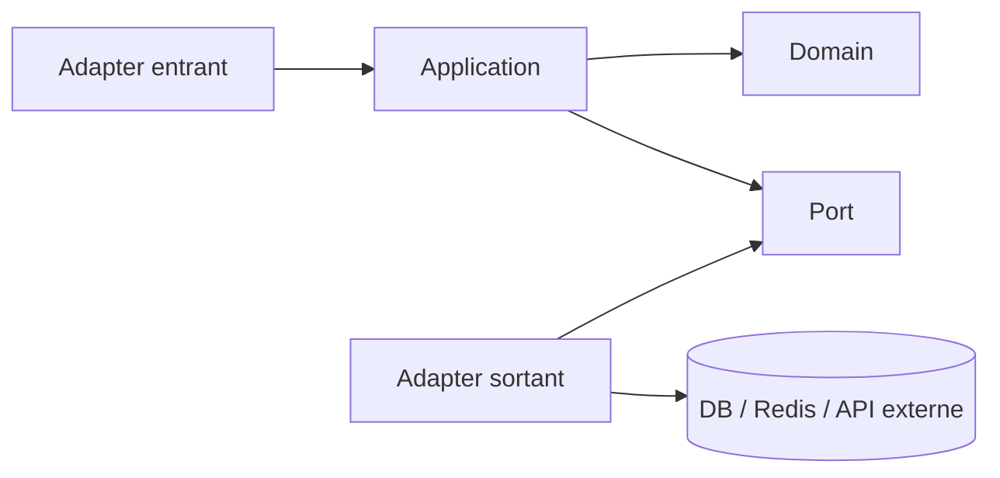

# Architecture de Cellar

## Décision

Cellar est construit comme un **monolithe modulaire Spring Boot avec Spring Modulith**.

Ce choix combine deux idées :

1. **Package by business capability** : le premier niveau de découpage est métier.
2. **Clean / Hexagonal Architecture à l'intérieur de chaque module** : le domaine est protégé des technologies.

Le but n'est pas de multiplier les couches pour elles-mêmes, mais de rendre les frontières explicites.

## Pourquoi ne pas utiliser cinq modules Maven techniques ?

Une structure globale du type :

```text
domain
business
data
infra
api
```

sépare correctement les responsabilités techniques, mais disperse une même fonctionnalité dans plusieurs endroits.

Pour comprendre entièrement le catalogue, il faut alors naviguer entre plusieurs modules.

Avec le Modulith, on commence par :

```text
catalog
inventory
ordering
identity
```

Chaque capacité métier possède ensuite ses propres couches internes.

Cela favorise la cohésion : ce qui change ensemble reste proche.

## Pourquoi pas des microservices ?

Les microservices ajouteraient immédiatement :

- appels réseau ;
- tolérance aux pannes distribuées ;
- observabilité inter-services ;
- gestion de versions entre services ;
- cohérence éventuelle ;
- déploiements multiples ;
- duplication de configuration ;
- complexité transactionnelle.

Cellar n'a pas besoin de ces coûts aujourd'hui.

Un Modulith garde des frontières suffisamment fortes pour permettre une extraction future, sans payer d'avance le coût du distribué.

## Structure d'un module

Exemple conceptuel :

```text
catalog/
├── <API publique du module>
└── internal/
    ├── domain/
    ├── application/
    └── adapter/
        ├── in/
        │   └── web/
        └── out/
            └── persistence/
```

### API publique du module

Le package racine du module contient uniquement ce que les autres modules sont autorisés à utiliser.

Il peut exposer plus tard :

- façades ;
- commandes publiques ;
- résultats publics ;
- événements métier explicitement partagés.

Les autres modules ne doivent pas entrer directement dans `internal`.

### internal/domain

Contient le modèle métier pur :

- entités métier ;
- value objects ;
- enums ;
- invariants ;
- règles métier.

Il ne dépend pas de Spring MVC, JPA, PostgreSQL, Redis ou JWT.

### internal/application

Contient :

- cas d'usage ;
- orchestration ;
- ports entrants/sortants ;
- transactions applicatives.

Cette couche coordonne le domaine mais ne doit pas connaître les détails techniques des adapters.

### internal/adapter/in

Ce qui entre dans le module :

- HTTP ;
- REST ;
- éventuellement messages ou tâches planifiées.

Pour le web, on y placera plus tard :

- Controllers ;
- Request DTO ;
- Response DTO ;
- mapping HTTP.

### internal/adapter/out

Ce qui permet au module de parler au monde extérieur :

- persistence JPA ;
- Redis ;
- génération de documents ;
- stockage de fichiers ;
- API externes.

Les adapters implémentent des ports définis vers l'intérieur.

## Sens des dépendances



Le domaine n'a aucune raison de connaître les adapters.

## Collaboration entre modules

Un module ne doit pas utiliser les classes internes d'un autre module.

Mauvais :

```text
ordering
  └── appelle directement
      catalog.internal.adapter.out.persistence.ProductEntity
```

Correct :

```text
ordering
  └── appelle
      catalog.<API publique>
```

Lorsque le découplage temporel apporte une vraie valeur, les modules pourront aussi collaborer par événements.

## Rôle de Spring Modulith

Spring Modulith servira à :

- détecter les modules applicatifs ;
- vérifier leurs frontières ;
- détecter les cycles ;
- empêcher les accès non souhaités aux packages internes ;
- tester les modules de manière ciblée ;
- documenter les dépendances entre modules ;
- gérer proprement certains événements inter-modules.

Les frontières ne reposent donc pas uniquement sur une convention humaine.

## Rôle d'ArchUnit

ArchUnit peut compléter Spring Modulith pour les règles internes qui ne sont pas exprimées directement par le modèle de modules.

Exemples futurs :

- `domain` ne dépend pas de JPA ;
- un Controller ne manipule pas une Entity JPA ;
- les adapters sortants ne sont pas appelés directement depuis un autre module.

## Persistence

PostgreSQL reste la source de vérité transactionnelle.

Chaque module possède ses adapters de persistence près de son métier.

On évite un énorme package global `data` qui connaîtrait tous les domaines.

Flyway gérera le schéma de manière versionnée.

## Redis, sécurité, PDF, WebSocket...

Une technologie n'est pas un domaine métier.

On ne créera donc pas automatiquement des modules `redis`, `pdf` ou `websocket`.

Ces technologies apparaîtront comme adapters du module qui en a besoin.

Exemples futurs :

```text
inventory/internal/adapter/out/cache/
identity/internal/adapter/out/security/
ordering/internal/adapter/out/document/
```

Un module transversal ne sera créé que s'il représente une vraie capacité partagée avec un contrat clair.

## Règles de conception

1. Le découpage principal est métier.
2. Un module possède son propre modèle interne.
3. Les autres modules passent par son API publique.
4. Aucun accès direct aux packages `internal` d'un autre module.
5. Le domaine reste indépendant des frameworks.
6. Les technologies restent dans les adapters.
7. Toute dépendance inter-module doit avoir une raison métier.
8. Aucun nouveau module n'est créé uniquement pour ranger une bibliothèque.
9. Les cycles entre modules sont interdits.
10. Les règles sont vérifiées automatiquement.

## Évolution

Cette architecture permet de commencer simplement.

Si un jour un domaine nécessite un cycle de déploiement ou une scalabilité réellement indépendante, ses frontières fonctionnelles seront déjà définies. Une extraction en service séparé devient alors un choix d'exploitation, pas une réécriture préalable du métier.
