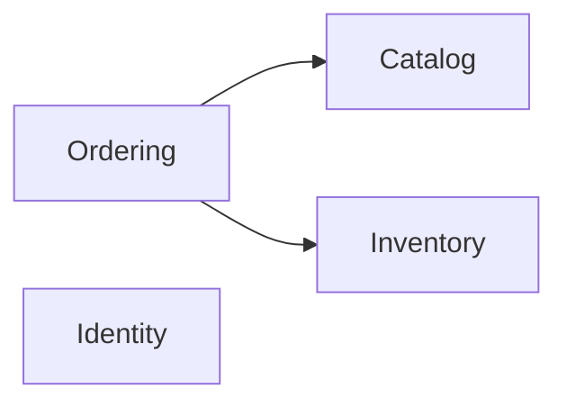

# 🧩 Modules métier de Cellar

> Les modules représentent des **capacités métier**, pas des technologies.

---

## 🗺️ Vue rapide

| Module | Question à laquelle il répond |
| --- | --- |
| **Catalog** | Qu'est-ce que Mjödheim vend ? |
| **Inventory** | Qu'est-ce qui existe physiquement et en quelle quantité ? |
| **Ordering** | Qu'est-ce qui a été commandé et où en est la commande ? |
| **Identity** | Qui utilise l'application et avec quels droits ? |



---

## 🍯 Catalog

### Responsabilité

Décrire ce que Mjödheim propose commercialement.

### Concepts actuels

- `Product`
- `ProductType`
- nom, description, volume, prix
- activation / désactivation

### Ce que Catalog ne fait pas

Catalog ne porte **pas** le stock physique.

> Un produit peut exister dans le catalogue alors qu'aucun lot n'est disponible.

---

## 📦 Inventory

### Responsabilité

Représenter le stock physique et expliquer ses variations.

### Concepts actuels

- `Batch`
- `StockMovement`
- `Allocation`
- quantité physique
- quantité réservée
- quantité disponible
- FEFO
- soft delete de lot

### Relations importantes

```text
Product
  ↓
Batch
  ├── StockMovement
  └── Allocation ← OrderLine
```

Inventory ne contrôle pas le cycle de vie complet d'une commande.

---

## 🧾 Ordering

### Responsabilité

Représenter une commande et ses transitions métier.

### Concepts actuels

- `Order`
- `OrderLine`
- `OrderStatus`
- confirmation
- préparation
- expédition
- annulation
- soft delete

### Collaboration

```text
Ordering → CatalogProducts
Ordering → InventoryOperations
```

Ordering dépend uniquement des **API publiques** des autres modules.

---

## 👤 Identity

### Responsabilité

Représenter les comptes utilisateurs et fournir les capacités d'authentification.

### Concepts actuels

- `User`
- `Role`
- `RefreshToken`
- comptes enabled / disabled
- soft delete
- authentification
- autorisations

### Mécanismes techniques

Les éléments suivants sont des détails d'adapter, pas le domaine lui-même :

- BCrypt ;
- JWT ;
- SHA-256 ;
- Spring Security ;
- OAuth2 Resource Server.

---

## 🔭 Modules futurs possibles

Ils ne sont créés que lorsqu'un vrai besoin métier autonome apparaît.

Exemples possibles :

- reporting ;
- notifications ;
- documents ;
- facturation.

> On ne crée pas un module uniquement pour ranger une bibliothèque ou une technologie.

---

## 📚 Lire ensuite

- [Architecture](ARCHITECTURE.md)
- [Pratiques professionnelles](PROFESSIONAL_PRACTICES.md)
