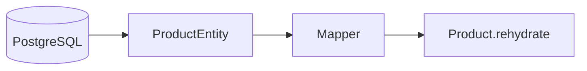

# 🍯 Product

> `Product` décrit **ce que Mjödheim vend**. Il ne représente pas le stock physique.

---

## 🎯 Responsabilité

Le produit appartient au module **Catalog**.

```text
Catalog.Product
      │
      └── décrit l'offre commerciale

Inventory.Batch
      └── décrit le stock physique
```

---

## 🧾 Données principales

| Champ | Rôle |
| --- | --- |
| `id` | identifiant |
| `name` | nom commercial |
| `type` | `MEAD` ou `BEER` |
| `description` | description libre |
| `volumeMl` | volume en millilitres |
| `price` | prix unitaire |
| `active` | disponibilité dans le catalogue |
| `createdAt` | création |
| `updatedAt` | dernière modification |

---

## 🧠 Domaine pur

`Product` n'est pas une Entity JPA.

Il ne contient donc pas :

```java
@Entity
@Table
@Column
```

La représentation PostgreSQL appartient à `ProductEntity`, dans l'adapter de persistence.

> Le domaine reste indépendant de Hibernate et PostgreSQL.

---

## ✅ Invariants

`Product` garantit notamment :

- nom non vide ;
- type obligatoire ;
- volume > 0 ;
- prix ≥ 0.

Les règles nécessitant un repository, comme l'unicité du nom, appartiennent à la couche application.

---

## 🏭 Création vs rehydratation

### `create(...)`

Utilisé pour un **nouveau produit** :

- pas encore d'identifiant ;
- actif par défaut ;
- dates initialisées ;
- invariants vérifiés.

### `rehydrate(...)`

Utilisé pour reconstruire un produit existant depuis la persistence.



---

## ✏️ Modification

`changeDetails(...)` modifie les informations éditables et réapplique les invariants du domaine.

`updatedAt` est mis à jour.

---

## ⏸️ Désactivation

`deactivate(...)` passe `active=false`.

Le produit n'est pas supprimé physiquement afin de conserver :

- les anciennes commandes ;
- les mouvements de stock ;
- les références historiques.

---

## 🔗 Voir aussi

- [Batch](../inventory/BATCH.md)
- [Architecture](../ARCHITECTURE.md)
