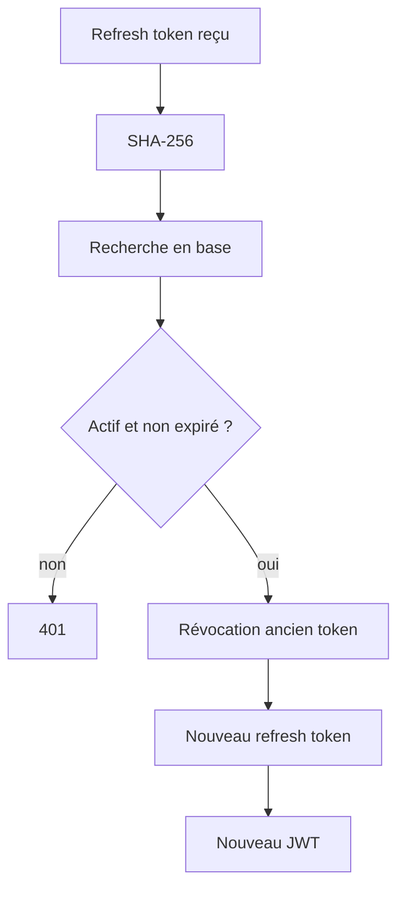

# ♻️ RefreshToken

> Le refresh token prolonge une session sans allonger excessivement la durée de vie du JWT d'accès.

---

## 🎟️ Deux jetons complémentaires

| Jeton | Durée | Usage |
| --- | --- | --- |
| **Access token JWT** | courte | authentifier les appels API |
| **Refresh token opaque** | longue | obtenir une nouvelle paire de jetons |

```text
Access token
└── Authorization: Bearer <JWT>

Refresh token
└── POST /api/auth/refresh
```

---

## 🔐 Stockage

Le token brut n'est **jamais** persisté.

Cellar stocke uniquement :

```text
SHA-256(rawRefreshToken)
```

Une fuite de la table ne permet donc pas d'utiliser directement les valeurs stockées comme refresh tokens.

---

## 🔄 Rotation

À chaque refresh :



---

## 🚪 Logout

Le logout révoque le refresh token présenté.

L'access token JWT déjà émis reste valide jusqu'à son expiration courte, ce qui est cohérent avec l'architecture stateless retenue.

---

## 🔗 Voir aussi

- [Sécurité](../SECURITY.md)
- [User](USER.md)
