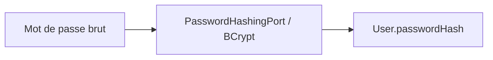

# 👤 User

> `User` représente un compte humain autorisé à utiliser Cellar.

---

## 🎯 Responsabilité

Le modèle porte :

| Donnée | Rôle |
| --- | --- |
| `email` | identifiant normalisé et immuable |
| `displayName` | nom affiché |
| `passwordHash` | hash BCrypt uniquement |
| `role` | `USER` ou `ADMIN` |
| `enabled` | autorisation d'authentification |
| `createdAt` | création |
| `updatedAt` | dernière modification |
| `deletedAt` | suppression logique |

---

## 🔒 Mot de passe

Le domaine ne reçoit jamais le mot de passe en clair.



Le mot de passe brut n'est ni stocké ni renvoyé.

---

## ⏸️ Désactivation

```text
enabled = false
```

Le compte reste présent mais ne peut plus s'authentifier.

---

## 🗑️ Soft delete

```text
deletedAt != null
```

Lors d'un soft delete :

- le compte est désactivé ;
- il disparaît des lectures métier normales ;
- ses refresh tokens actifs sont révoqués ;
- l'historique reste traçable.

---

## 🔗 Voir aussi

- [Sécurité](../SECURITY.md)
- [RefreshToken](REFRESH_TOKEN.md)
