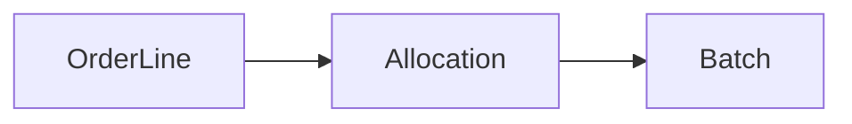

# 🔗 Allocation

> `Allocation` représente l'affectation d'une quantité d'un `Batch` à une `OrderLine`.

---

## 🧭 Relation



Inventory ne dépend donc pas directement des classes internes de Ordering.

---

## 🔄 États

| État | Signification |
| --- | --- |
| `RESERVED` | quantité réservée |
| `RELEASED` | réservation libérée |
| `CONSUMED` | réservation consommée par l'expédition |

Transition autorisée :

```text
RESERVED ──> RELEASED
    └──────> CONSUMED
```

Une allocation déjà libérée ou consommée ne change plus d'état.

---

## 🧩 Pourquoi une entité séparée ?

Une ligne de commande peut être satisfaite par plusieurs lots.

```text
OrderLine : 12 unités
├── Batch A → 5
└── Batch B → 7
```

L'allocation permet donc de reconstruire exactement **quels lots ont servi à quelle commande**.

---

## 🔗 Voir aussi

- [Batch](BATCH.md)
- [OrderLine](../ordering/ORDER_LINE.md)
