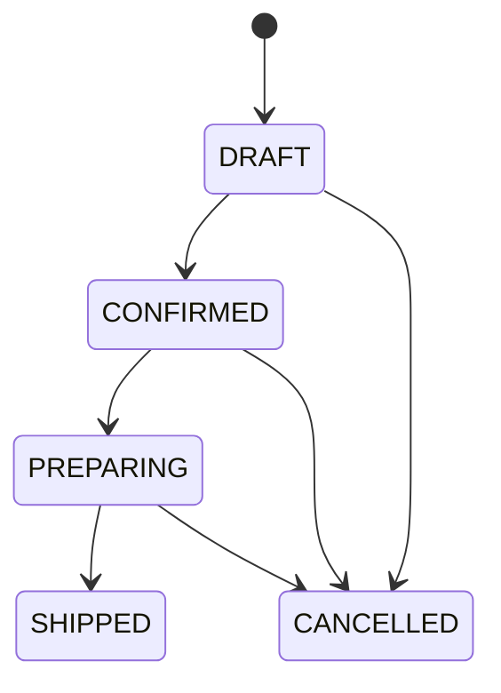

# 🧾 Order

> `Order` est l'agrégat qui porte le cycle de vie d'une commande.

---

## 🔄 Cycle de vie



Une commande expédiée ne peut plus être annulée.

---

## ✅ Règles métier

- création en `DRAFT` ;
- ajout de lignes uniquement en brouillon ;
- impossible de confirmer une commande vide ;
- préparation uniquement après confirmation ;
- expédition uniquement pendant la préparation ;
- annulation impossible après expédition ;
- soft delete uniquement en `DRAFT` ou `CANCELLED`.

---

## 💶 Snapshot commercial

Chaque `OrderLine` conserve :

- nom du produit ;
- prix unitaire ;
- quantité.

Une modification ultérieure du catalogue ne change donc jamais l'historique de la commande.

---

## 📦 Interaction avec Inventory

À la confirmation :

```text
CONFIRMED
   ↓
réservation FEFO
   ↓
Allocation(s)
```

À l'expédition :

```text
PREPARING
   ↓
consommation des allocations
   ↓
StockMovement SHIPMENT
   ↓
SHIPPED
```

À l'annulation d'une commande confirmée ou en préparation, les allocations actives sont libérées.

---

## 🧩 Frontières Modulith

```text
Ordering → CatalogProducts
Ordering → InventoryOperations
```

Ordering ne lit jamais directement les classes internes de Catalog ou Inventory.

---

## 🔗 Voir aussi

- [OrderLine](ORDER_LINE.md)
- [Allocation](../inventory/ALLOCATION.md)
